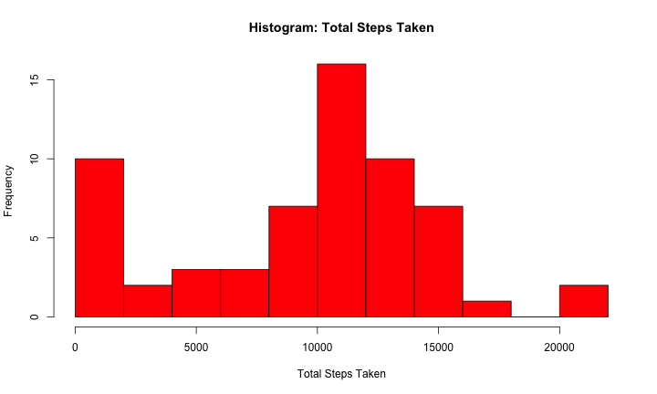
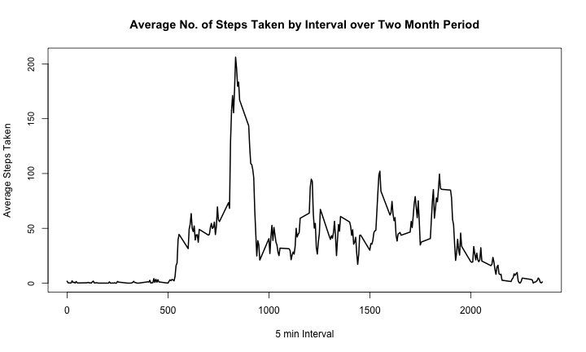
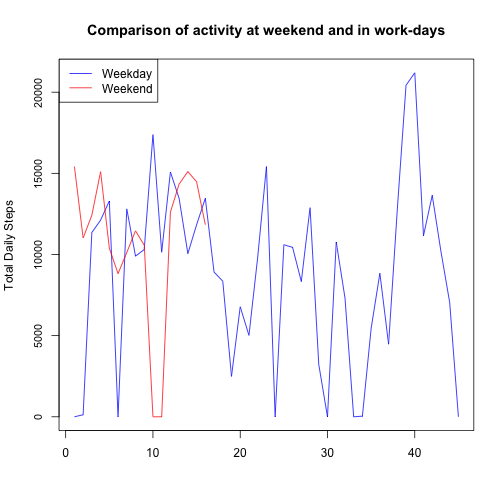
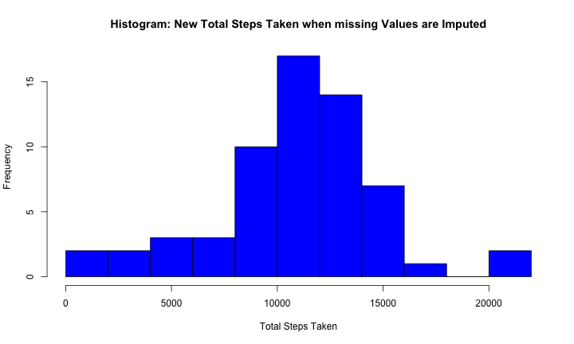
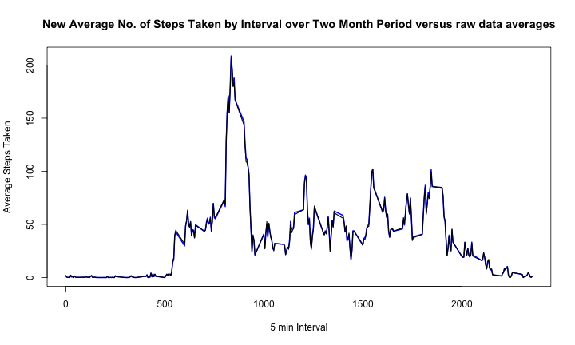
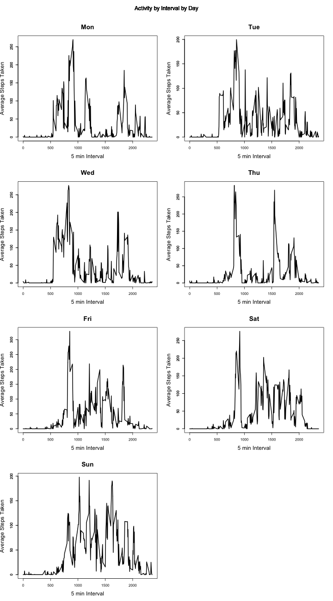
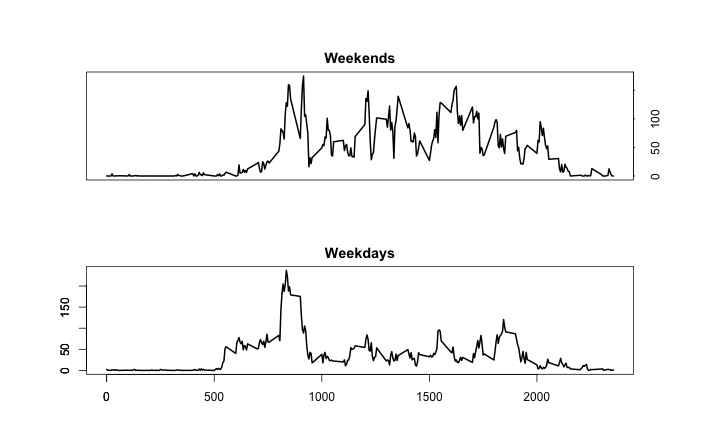

Reproducible Research: Assignment 1
========================================================

Total Daily Activity
=====================
This personal monitoring device measured the number steps an individual takes at five minute intervals. The sample data was collected over a two month period between October and November of 2012. 


```r
setwd(".");
url <- "https://d396qusza40orc.cloudfront.net/repdata%2Fdata%2Factivity.zip"
url_split <- unlist(strsplit(url, "%2F"))
zip_file <- url_split[length(url_split)]
zip_dir <- unlist(strsplit(zip_file, "\\."))[1];

check_files <- function(address = url, wnt = zip_file, dir = zip_dir)
{
if (wnt %in% list.files(".") && length(list.files(paste(".", dir, sep = "/", collapse = "/"))) > 0)
        
        {
        print(paste("files already downloaded and are:", dir(paste(".", dir, sep = "/", collapse = ""))))
        }
else
        {        
        if (!wnt %in% list.files("."))
                {
                download.file(address, destfile = wnt, method = "curl")
                }
        if(!exists(paste(".", dir, sep = "/", collapse = "/")))
                {
                dir.create(paste(".", dir, sep = "/", collapse = "/"), showWarnings = FALSE, mode = "0757")
                tgt_dir <- paste(".", dir, sep = "/", collapse = "/")
                }
        if(length(list.files(tgt_dir)) == 0)
                {
                tgt_files  <- unzip(wnt, exdir = ".", overwrite = TRUE);

                }

        }

}

load_data <- function(dir, number)
        {
        tgt <- paste(".", dir, sep = "/", collapse = "/");        
        x <- read.csv(list.files(tgt)[number]);

        return(x);
        }

check_files();
```

```
## [1] "files already downloaded and are: activity.csv"
```

```r
file <- read.csv("./activity/activity.csv")
file$date <- as.Date(file$date);
```

I subset the data to generate plots of the total daily activity and activity by time period. First, I created vectors of dates and then the intervals. and I used these to calculate the daily total setps in the  


```r
file$date <- as.Date(file$date);
dates <- unique(file$date);
dates <- as.Date(dates);
days <- unique(format(dates, "%a"));
intervals <- unique(file$interval);
daily_total_steps <- sapply(dates, function(x) sum(file$steps[file$date == x], na.rm =TRUE));

mean_total <- mean(daily_total_steps, na.rm = TRUE);

median_total <- median(daily_total_steps, na.rm = TRUE);

max_total <- max(daily_total_steps, na.rm = TRUE);
sd_total <- sd(daily_total_steps, na.rm=TRUE);

total_steps_raw <- sum(daily_total_steps, na.rm = TRUE)
```
The subject walked 9354.2295 steps on average. The median steps taken were 10395 on daily basis. We see this in the histogram of the total steps data below. 


```r
print(c("Average steps Taken = ", round(mean_total, 0))); 
```

```
## [1] "Average steps Taken = " "9354"
```

```r
print(c("Median steps taken = ", round(median_total, 0)));
```

```
## [1] "Median steps taken = " "10395"
```
A histogram of the average daily activity is given below. 


```r
hist(daily_total_steps, col = "red", breaks = 10, main = "", xlab = "", ylab = "");
title(main = "Histogram: Total Steps Taken", ylab = "Frequency", xlab = "Total Steps Taken")
```

 

Activity Pattern by Five Minute Interval
=======================================
The activity pattern varied throughout the day. Minimum activity was prevalent in the beginning stages of the measurement period.   


```r
mean_steps_by_interval <- sapply(intervals, function(x) mean(file$steps[file$interval ==x], na.rm = TRUE))

plot(mean_steps_by_interval ~ intervals, type = "l", lwd= 2, main = "", xlab = "", ylab = "", yaxt = "n");
title(main = "Average No. of Steps Taken by Interval over Two Month Period");
title(xlab = "5 min Interval", ylab = "Average Steps Taken");
axis(2, cex.axis = 0.9);
```

 

Maximum activity occured in the 835 intervals period (2.8 hours from the base time). At this period the subject took 206 steps on average.


```r
max <- max(mean_steps_by_interval, na.rm = TRUE);
max_index <- which(mean_steps_by_interval == max);

print(c("The max activity occurs at interval ", intervals[max_index]));
```

```
## [1] "The max activity occurs at interval "
## [2] "835"
```

```r
print(c("the average maximum number of steps taken in a five minute interval is ", round(max, 0))); 
```

```
## [1] "the average maximum number of steps taken in a five minute interval is "
## [2] "206"
```

Replacing Missing Data
=======================


```r
na <- which(is.na(file$steps));
l_na <- length(na);
print(c("Total missing periods were", l_na, " out of a total sample size of ", nrow(file), ". 
        This equated to a total of ", l_na/288, " missing days of data."));
```

```
## [1] "Total missing periods were"             
## [2] "2304"                                   
## [3] " out of a total sample size of "        
## [4] "17568"                                  
## [5] ". \n        This equated to a total of "
## [6] "8"                                      
## [7] " missing days of data."
```

The data det had a total of 2304 missing values, equating to 8 days of missing data from the total sample period of 61 days. 

The data showed some differences in behaviour between weekends and weekdays. On average the subject walked more at weekends. Walking activity was more varied during the work week however. This can be seen below as the average number of steps taken was higher at weekends, but the maximum number of steps taken  was higher during the workweek. The variation in the data may be due to the small sample set of weekend data, however. 


```r
library(timeDate);
dates <- unique(file$date);
dates <- as.Date(dates);
weekdays <- which(isWeekday(dates));
weekends <- which(isWeekend(dates));

weekday_steps <- sapply(dates[weekdays], function(x) sum(file$steps[file$date == x], na.rm =TRUE));
weekend_steps <- sapply(dates[weekends], function(x) sum(file$steps[file$date == x], na.rm =TRUE));

mean_weekday <- mean(weekday_steps, na.rm = TRUE);
sd_weekdays <- sd(weekday_steps, na.rm = TRUE);
mean_weekend <- mean(weekend_steps, na.rm = TRUE);
sd_weekends <- sd(weekend_steps, na.rm = TRUE);


plot(weekday_steps, type = "l", yaxt = "n", main = "", xlab = "", ylab = "", col = "blue");
lines(weekend_steps, col = "red");
title(ylab = "Total Daily Steps", main = "Comparison of activity at weekend and in work-days");
axis(2, cex.axis = 0.9);
legend("topleft", c("Weekday", "Weekend"), lty = c(1,1), col = c("blue", "red"));
```

 
Imputing Missing Values
=======================
Given the variability in data, and assuming a workweek "routine", I filled in missing data by taking the mean activity for each five minute period for each day of the week. I then added these data to the day according the day of the week and the period in which data was missing. 


```r
new_set <- function(day)
        {
        day_set <- subset(file, format(date, "%a") == day, select = colnames(file));
        interval <- unique(day_set$interval);
        dates <- unique(day_set$date)
        day_means <- sapply(interval, function(x) mean(day_set$steps[day_set$interval == x], na.rm =TRUE));

        new_vals <- as.data.frame(cbind(day_means, dates, interval), colnames = colnames(day_set));

        replace <- which(is.na(day_set$steps));

        interval <- day_set$interval[replace];
        date <- as.Date(day_set$date[replace], origen = "1970-01-01");
        
        index_new_vals <- sapply(replace, function(x) which(new_vals$interval == day_set$interval[x]))

        steps <- sapply(index_new_vals, function(x) day_means[x]);

        replacements <- as.data.frame(cbind(steps, date, interval));
        colnames(replacements) <- colnames(day_set);

        

        count = 1;
        if(count %in% replace)
                        { 
                        new_set <- as.data.frame(cbind(replacements[count,1],replacements[count,2],replacements[count,3])) ;
                        colnames(new_set) <- colnames(day_set);
                        count = count+1;
                        } 
                        else
                        {
                        new_set <- as.data.frame(cbind(day_set[1,1],day_set[1,2],day_set[1,3]));
                        colnames(new_set) <- colnames(day_set);
                        }
        for(i in as.integer(2:nrow(day_set)))
               {
                if(i %in% replace)
                       {
                        new_set <- rbind(new_set,replacements[count,]);
                        count = count+1;
                        }
                
               else
                        
                        new_set <- rbind(new_set, day_set[i,]);
                        
                }

        
        

        return(new_set);
}

for (i in 1:length(days))
        {
        if(i == 1)
                {
                new_data <- as.data.frame(new_set(days[i]));
                colnames(new_data) <- colnames(file);
                }
        else
                {
                new_data <- rbind(new_data, new_set(days[i]));
                colnames(new_data) <- colnames(file);
                }
        }
```
Imputing data to the set had the effect of increasing the calculated mean and the total steps counted by 16%. The median of the data increased by 6%. The maximum step count did not change, however and the standard deviation of the sample set fell by over 25%. 


```r
new_daily_total_steps <- sapply(dates, function(x) sum(new_data$steps[new_data$date == x], na.rm =TRUE));
new_mean_steps_by_interval <- sapply(intervals, function(x) mean(new_data$steps[new_data$interval ==x], na.rm = TRUE))                   
print(c("mean steps taken daily as multiple of mean of raw data", round(mean(new_daily_total_steps)/mean_total, digits=2)));
```

```
## [1] "mean steps taken daily as multiple of mean of raw data"
## [2] "1.16"
```

```r
print(c("median steps by day as multiple of median of raw data", round(median(new_daily_total_steps)/median_total, digits=2)));
```

```
## [1] "median steps by day as multiple of median of raw data"
## [2] "1.06"
```

```r
print(c("standard Dev. of new data as multiple of SD of raw data", round(sd(new_daily_total_steps)/sd_total, digits = 2)));
```

```
## [1] "standard Dev. of new data as multiple of SD of raw data"
## [2] "0.74"
```

```r
print(c("Max step count in new set as a multiple of raw data set", round(max(new_daily_total_steps)/max_total, digits = 2)))
```

```
## [1] "Max step count in new set as a multiple of raw data set"
## [2] "1"
```

```r
print(c("total steps taken in infilled sample ", round(sum(new_daily_total_steps)/total_steps_raw, digit = 2)));
```

```
## [1] "total steps taken in infilled sample "
## [2] "1.16"
```

The effect of imputing data on the profile of daily activity was slight. The chart below shows average daily activity in the new, infilled data set overlaid on the old, raw data set. The difference in the charts is barely perceptible. Given this, we can conclude that the distortion effect on the raw data is small. 


```r
hist(new_daily_total_steps, col = "blue", breaks = 10, main = "", xlab = "", ylab = "");
title(main = "Histogram: New Total Steps Taken when missing Values are Imputed", ylab = "Frequency", xlab = "Total Steps Taken")
```

 

```r
plot(new_mean_steps_by_interval ~ intervals, type = "l", lwd= 2, col = "blue", main = "", xlab = "", ylab = "", yaxt = 'n');
lines(mean_steps_by_interval ~ intervals, col = "black", lwd = 1.5);

title(main = "New Average No. of Steps Taken by Interval over Two Month Period versus raw data averages");
title(xlab = "5 min Interval", ylab = "Average Steps Taken");
axis(2, cex.axis = 1);
```

 

Activity Patterns by Day- infilled Data
========================================================
As mentioned previously activity levels differ by day. There was a reasonably marked diffference between activity levels in the work-week and those at the weekend. Indeed activity levels vary across days with marked spikes in activity on Mondays to Thursdays, but steadier, more sustained activity  on Friday and over the weekend.  


```r
par(mfrow = c(4,2), oma = c(0,0,4,0));


for (i in 1:length(days))
        {
                day_data <- as.data.frame(new_set(days[i]));
                colnames(day_data) <- colnames(file);
                day_profile <- sapply(intervals, function(x) mean(day_data$steps[day_data$interval ==x], na.rm = TRUE));
                plot(day_profile ~ intervals, type = 'l', lwd = 2, xlab = "", ylab = "", main = "");
                mtext("Activity by Interval by Day", line = 1.5, outer = TRUE); 
                title(main = days[i], xlab = "5 min Interval", ylab = "Average Steps Taken", cex.lab = 1.5, cex.main = 1.75);
                axis(2, cex.axis = 1);
        }
```

 

When Taken together, weekday activity patterns compared to weekday patterns are shown below. Weekend activity is sustained over a longer period of time. Weekday activity is very concentrated in a relatively short space of time. 


```r
par(mfrow = c(2,1), oma = c(0,2,3,4));
par(bg= "white"); par(mar = c(4,4,2,2));

library(timeDate);
new_data$date <- as.Date(new_data$date, origin = "1970-01-01")
weekday_set <- subset(new_data, isWeekday(date), select = colnames(file));
weekend_set <- subset(new_data, isWeekend(date), select = colnames(file));
add_data <- isWeekday(new_data$date)
new_data <- as.data.frame(cbind(new_data, add_data));
colnames(new_data) <- c("steps", "date", "interval", "weekday");

weekday_profile <- sapply(intervals, function(x) mean(weekday_set$steps[weekday_set$interval ==x], na.rm = TRUE));
weekend_profile <- sapply(intervals, function(x) mean(weekend_set$steps[weekend_set$interval ==x], na.rm = TRUE));

plot(weekend_profile ~ intervals, type = 'l', lwd = 2, xlab = "", ylab = "", main = "", xaxt = 'n', yaxt = 'n');
title(main = "Weekends");
axis(4, cex.axis = 1, at = seq(0, 220, 50), tck = -.01);


plot(weekday_profile ~ intervals, type = 'l', lwd = 2, xlab = "", ylab = "", main = "");
title(main = "Weekdays");

axis(1, at = seq(0, length(intervals), 500), xlab = "Interval", cex.lab = 1.5);
axis(2, cex.axis = 1, at = seq(0, 220, 50), tck = -.005);
```

 
